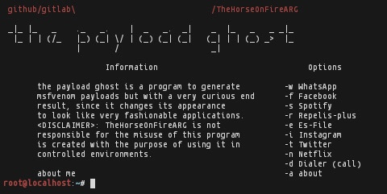

<h1>What is the Payload Ghost?</h1>

The Payload Ghost is a simple script that depends on different programs to make its only purpose functional, which is to camouflage a Metasploit-Framework payload by changing 
the Icon and name.

<h1>Introduction</h1>

You must unzip the Images.zip file and then move it to the Images folder at the path:<code>/usr/share</code>
 

You should have previously granted permissions to that folder. If you want, you can move the tpg launcher to 
  <code>/bin or /usr/bin</code> .

 

Otherwise, try manually downloading the following dependencies (in many Linux distributions they come from the package manager):

<h1>Installation:</h1>

In your linux environment you should have the dependencies shown below and the steps above.
Here are the commands to automate everything (TPG does not have a program to uninstall so remember the steps).

 
<code>
sudo chmod +x tpg Images && unzip Images.zip && cp -r Images /usr/share/ && cp tpg /bin
</code>

<h1>dependencies</h1>
<h6>Java:</h6>
 https://www.java.com/

<h6>Keytool:</h6>
 https://docs.oracle.com/en/java/javase/11/tools/keytool.html

<h6>Jarsigner:</h6>
 https://docs.oracle.com/en/java/javase/11/tools/jarsigner.html

<h6>Metasploit-Framework:</h6>
 https://www.metasploit.com/

<h6>Apktool:</h6>
 https://ibotpeaches.github.io/Apktool/install/

<h6>util-linux:</h6>
 https://lore.kernel.org/util-linux/

<h1>Termux Proot-Distro Nethunter</h1>

<h1>about</h1>
<h6>Twitter: https://twitter.com/horse_arg      
GitHub:  https://github.com/TheHorseOnFireARG
GitLab:  https://gitlab.com/TheHorseOnFireARG  
Twitch:  https://www.twitch.tv/horse_arg </h6>
