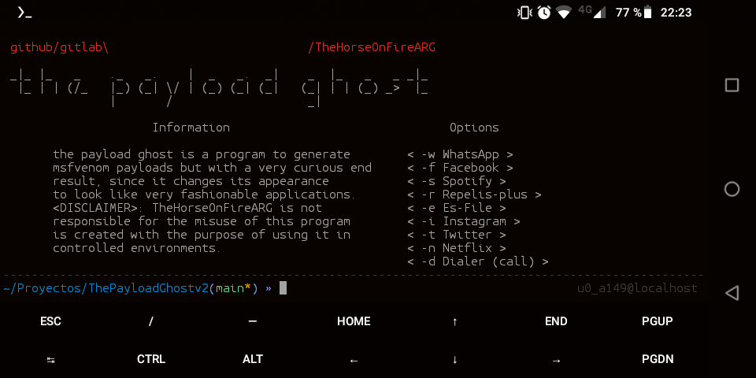

 
<h1>The Payload Ghost for Termux</h1>

this program to run in termux must be run within i-Haklab to run without dependency errors.
If not try to manually download the following dependencies:

<h6>i-Haklab:</h6>
 https://github.com/ivam3/i-Haklab

<h6>Java:</h6>
 https://www.java.com/

<h6>Keytool:</h6>
 https://github.com/mojohaus/keytool

<h6>Jarsigner:</h6>
 https://github.com/ivam3/i-Haklab

<h6>Metasploit-Framework:</h6>
 https://github.com/ivam3/i-Haklab

<h6>Apktool:</h6>
 https://github.com/ivam3/i-Haklab

<h6>util-linux:</h6>
 https://lore.kernel.org/util-linux/

 <blockquote class="blockquote">
              

           
         
                     Information                             Options 
       the payload ghost is a program to generate         -w WhatsApp 
       msfvenom payloads but with a very curious end      -f Facebook 
       result, since it changes its appearance            -s Spotify 
       to look like very fashionable applications.        -r Repelis-plus 
       <DISCLAIMER>: TheHorseOnFireARG is not             -e Es-File 
       responsible for the misuse of this program         -i Instagram 
       is created with the purpose of using it in         -t Twitter 
       controlled environments.                           -n Netflix 
                                                          -d Dialer (call)
      
